# CasaWallet

### Guida utente

Sapere ogni giorno quanto puoi spendere davvero. Aggiornata il {{date}}.

## Come funziona in 3 regole

1. **Registra tutto.** Ogni spesa e ogni entrata entra nell'app: a mano, con la foto dello scontrino o importando l'estratto conto. Le spese fisse le registra l'app da sola.
2. **Le tasse si mettono via alla fonte.** Su ogni entrata con Partita IVA una percentuale finisce nel salvadanaio tasse. Quei soldi non sono tuoi: non li vedi nel disponibile.
3. **I fondi non si toccano.** I soldi parcheggiati negli obiettivi (vacanze, mutuo, cuscinetto) restano fuori dal disponibile finché non li prelevi con un gesto esplicito.

Il numero che conta è uno solo: il **Disponibile reale**. È il saldo del conto meno le tasse da versare, meno i fondi, meno le spese fisse che devono ancora uscire questo mese.

## Punto zero

Il punto di partenza: dici all'app quanto c'è sul conto oggi e da lì in poi tiene i conti con te.

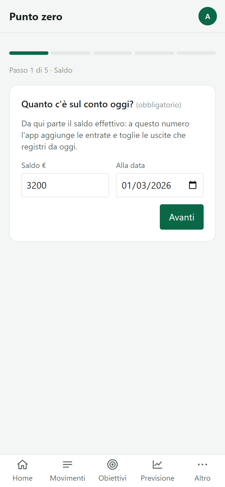

1. Al primo accesso si apre il Punto zero. Lo ritrovi in **Altro → Impostazioni → Apri la procedura guidata**.
2. Inserisci il **saldo del conto** e la data: è l'unico passo obbligatorio.
3. Aggiungi le spese fisse che conosci (rata, affitto, internet): diventano ricorrenze.
4. Se hai la Partita IVA indica la % di tasse da mettere via su ogni entrata.
5. Crea il primo obiettivo e condividi il codice invito con chi vive con te.

**Consiglio:** prendi il saldo dall'app della banca in quel momento, non a memoria. Da lì ogni cifra torna.

## Dashboard e Disponibile reale

La Home risponde a una domanda sola: quanto posso spendere oggi senza fare danni?

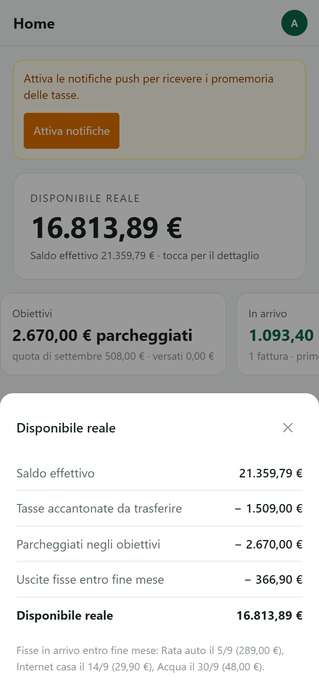

1. Il numero grande è il **Disponibile reale**. Sotto trovi il saldo del conto.
2. Tocca il numero: si apre il dettaglio con le voci sottratte (tasse da versare, fondi, spese fisse in arrivo).
3. La card è **neutra** di norma, **gialla** se resta meno del 20% delle spese fisse mensili, **rossa** se sei sotto zero.
4. Le tre card sotto riassumono obiettivi, incassi in arrivo e prossima scadenza fiscale. Tocca per il dettaglio.
5. **Il mese** si apre a piacere: entrate e uscite con confronto, previsione a fine mese, grafico.

**Consiglio:** guarda il Disponibile reale prima di ogni spesa non prevista. Se è giallo, rimanda.

## Registrare spese ed entrate

Il bottone **+** in basso a destra è sempre a portata di pollice: tre modi per registrare, nessuna scusa.

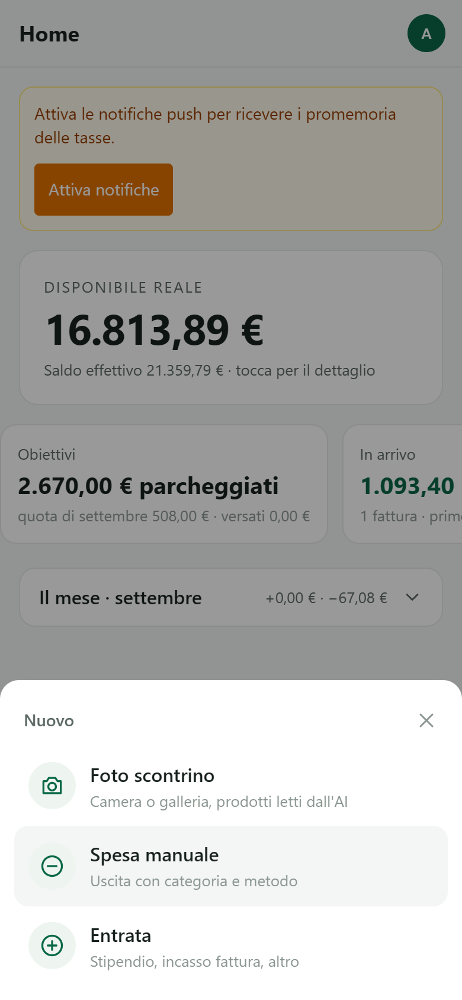

1. Tocca **+**: scegli **Foto scontrino**, **Spesa manuale** o **Entrata**.
2. Spesa manuale: importo, data, categoria, metodo. Tre tocchi e hai finito.
3. Entrata: se hai la Partita IVA la % tasse è già compilata. Se l'importo coincide con una fattura in attesa, l'app te lo dice e la segna incassata.
4. Dopo un'entrata l'app propone di **distribuire** il netto sugli obiettivi: confermi con un tocco.
5. Attiva **Ripeti** se la spesa torna ogni mese: nasce una ricorrenza.

**Consiglio:** registra al momento, non a fine giornata. Dieci secondi ora valgono dieci minuti dopo.

## Foto dello scontrino

Fotografi lo scontrino, l'app legge negozio, totale e prodotti. Da qui nascono la lista della spesa e il confronto tra negozi.

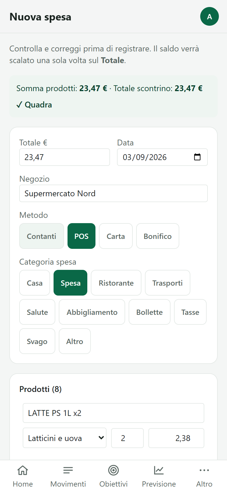

1. Tocca **+ → Foto scontrino**, poi **Scatta foto** o **Carica da galleria**.
2. Scontrino lungo? Attiva la modalità multi-foto e scatta le sezioni una dopo l'altra.
3. Tocca **Analizza**: controlla totale, data e prodotti. Puoi correggere qualsiasi riga.
4. **Conferma**: nasce la spesa e i prodotti finiscono nello storico.

**Consiglio:** appoggia lo scontrino su un piano chiaro, luce dall'alto. Le pieghe confondono la lettura.

## Movimenti

Uscite ed entrate del mese, con il confronto al mese precedente. Le uscite sono divise in fisse e variabili: è la prima risposta a "dove vanno i soldi".

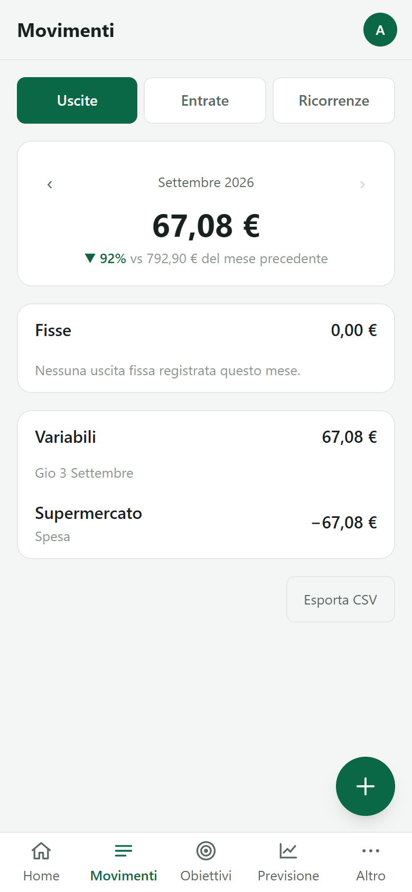

1. Apri **Movimenti**: in alto scegli **Uscite**, **Entrate** o **Ricorrenze**.
2. Le frecce accanto al mese ti portano indietro nel tempo.
3. **Fisse** sono le spese nate dalle ricorrenze; **Variabili** tutto il resto, giorno per giorno.
4. Tocca una riga per modificarla o eliminarla.
5. Nelle Entrate vedi la % tasse messa da parte e il numero della fattura, se collegata.

**Consiglio:** se le variabili superano le fisse per due mesi di fila, è lì che si può tagliare.

## Ricorrenze

Rata, affitto, internet, stipendio: le registri una volta, l'app le crea da sola alla scadenza e le toglie dal disponibile prima che escano.

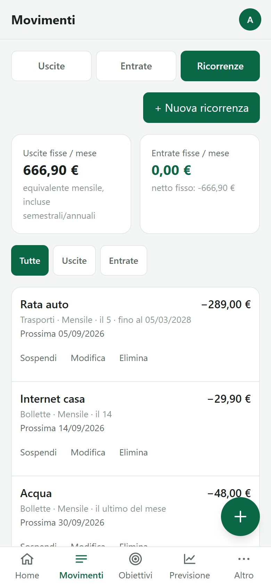

1. In **Movimenti → Ricorrenze** tocca **+ Nuova ricorrenza**.
2. Scegli frequenza (settimanale, mensile, semestrale, annuale) e giorno. **31** vale "ultimo giorno del mese".
3. Indica la data di fine se c'è (per esempio l'ultima rata dell'auto).
4. **Automatica**: la spesa nasce da sola. **Chiedi conferma**: ricevi un avviso e confermi importo e data.
5. Le ricorrenze semestrali e annuali mostrano l'equivalente mensile: è quanto dovresti mettere via ogni mese.

**Consiglio:** importa l'estratto conto e lascia che l'app ti proponga le ricorrenze che non ricordi.

## Obiettivi

Piccoli salvadanai con uno scopo: vacanze entro una data, una spesa periodica grossa da spalmare, un cuscinetto per gli imprevisti. Il salvadanaio tasse vive qui, ma resta personale.

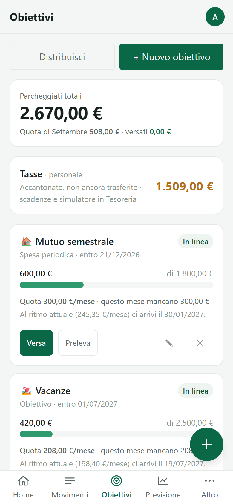

1. Ogni obiettivo mostra quanto hai parcheggiato, la quota mensile e lo stato: **in linea**, **in anticipo**, **in ritardo**, **raggiunto**.
2. **Versa** e **Preleva** muovono i soldi dentro e fuori. Un prelievo può registrare anche l'uscita reale.
3. **Distribuisci** ripartisce un importo sugli obiettivi: prima le spese periodiche in scadenza, poi i traguardi, poi i cuscinetti.
4. Una spesa periodica collegata a una ricorrenza si svuota da sola alla scadenza.
5. La voce **Tasse** mostra quanto hai accantonato e non ancora versato.

**Consiglio:** tre obiettivi bastano: un cuscinetto, la spesa grossa dell'anno, un desiderio.

## Nuovo obiettivo

Dici cosa vuoi e quando: l'app ti dice quanto mettere via ogni mese.

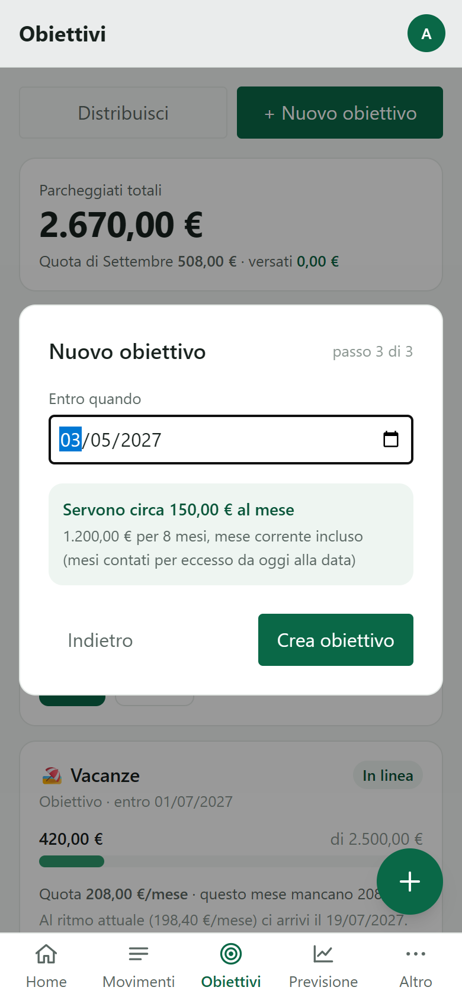

1. In **Obiettivi** tocca **+ Nuovo obiettivo**.
2. Scegli il tipo: **traguardo con data**, **spesa periodica** (collegata a una ricorrenza) o **cuscinetto**.
3. Nome, importo, data. Compare subito "servono N € al mese per M mesi".
4. Priorità alta, media o bassa: decide l'ordine con cui **Distribuisci** alimenta gli obiettivi.
5. **Famiglia** o **Solo io**: gli obiettivi sono condivisi salvo che tu scelga altrimenti.

**Consiglio:** se la quota mensile ti sembra alta, sposta la data invece di rinunciare.

## Previsione

I prossimi 90 giorni: spese fisse, scadenze fiscali, incassi attesi e quote degli obiettivi, giorno per giorno. Ti dice in anticipo se la rata del 5 e l'acconto del 30 stanno insieme.

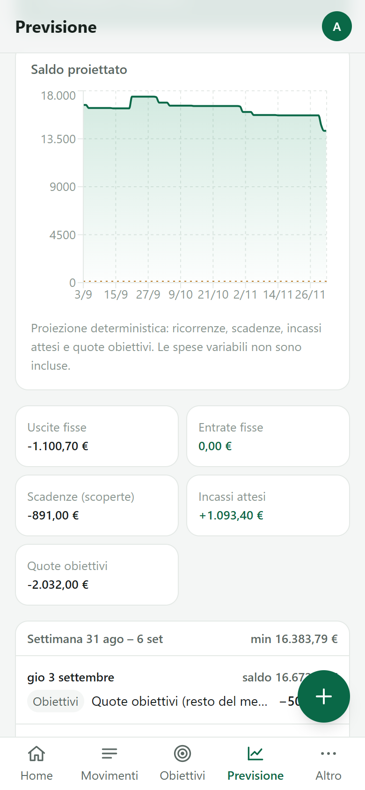

1. Apri **Previsione**: il verdetto in alto dice se ce la fai e qual è il giorno più basso.
2. Il grafico mostra il saldo proiettato. La linea rossa è lo zero.
3. La timeline è divisa per settimana: ogni evento con la sua data e il segno.
4. Un giorno sotto zero è evidenziato in rosso, con l'evento che lo causa.
5. Cambia orizzonte con 30, 60, 90 o 180 giorni.

**Consiglio:** se vedi un giorno rosso, hai tre leve: spostare una spesa, anticipare un incasso, ridurre una quota obiettivo per un mese.

## Budget

Un tetto mensile per categoria. La spesa del mese si aggiorna da sola e la barra si colora quando ti avvicini al limite.

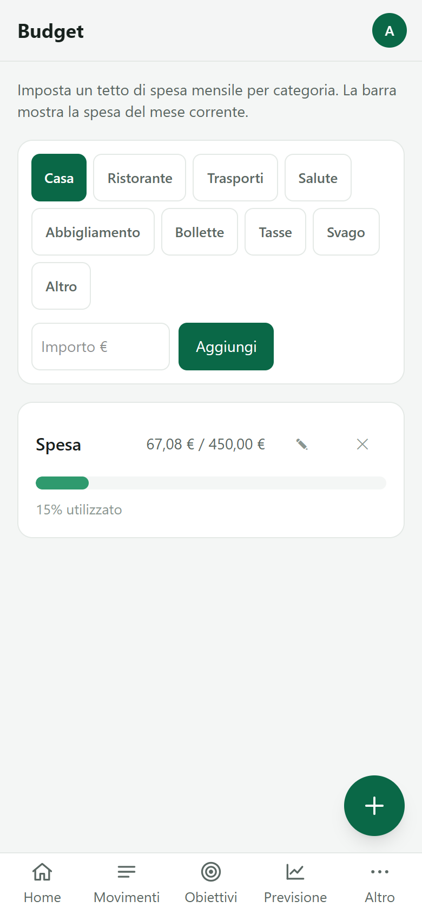

1. In **Altro → Budget** scegli la categoria e l'importo mensile.
2. La barra mostra quanto hai già speso; oltre l'80% diventa gialla, oltre il 100% rossa.
3. Modifica o elimina un budget in qualsiasi momento.

**Consiglio:** parti dal budget **Spesa**: è la categoria dove si risparmia di più senza accorgersene.

## Lista spesa e Analisi

Dagli scontrini l'app impara ogni quanto ricompri un prodotto e dove costa meno.

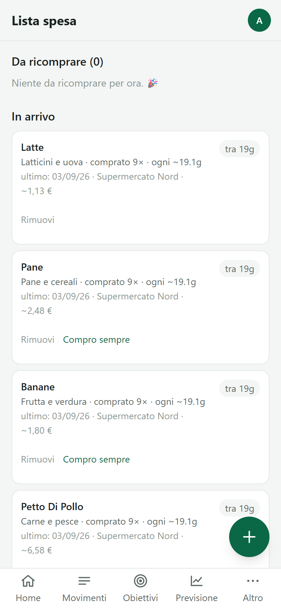

1. **Altro → Lista spesa**: i prodotti da ricomprare in alto, con la data prevista.
2. Segna un prodotto come "sempre in lista" oppure nascondilo fino al prossimo acquisto.
3. **Altro → Analisi**: spesa per categoria e per negozio, prodotti su cui spendi di più.
4. La sezione **Dove conviene comprare** confronta il prezzo medio per categoria tra i negozi.

**Consiglio:** servono almeno due scontrini dello stesso negozio per una previsione utile.

## Dove conviene comprare

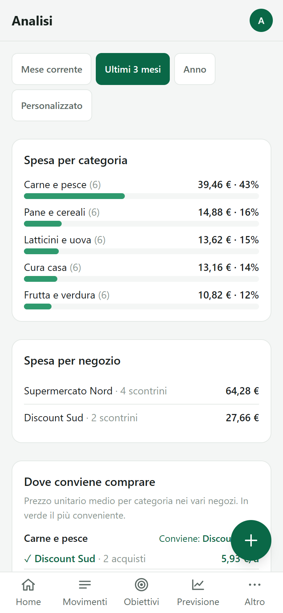

1. Ogni categoria mostra i negozi dal più conveniente al più caro.
2. Il confronto usa il prezzo unitario medio dei prodotti che hai davvero comprato.
3. Cambia periodo in alto per vedere se un negozio ha alzato i prezzi.

**Consiglio:** non serve cambiare negozio per tutto: sposta solo le due categorie dove la differenza è più grande.

## Tesoreria e tasse

Per chi ha la Partita IVA: scadenze, stima di saldo e acconti, e un simulatore che risponde alla domanda "posso prendere questi soldi dal fondo tasse e rientrare in tempo?".

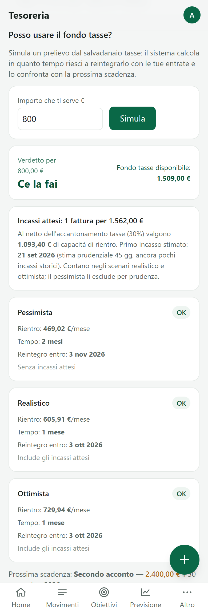

1. In **Altro → Tesoreria** inserisci le scadenze fiscali oppure crea quelle standard dalla stima.
2. Il profilo fiscale calcola la % minima consigliata da mettere via su ogni entrata.
3. Il **simulatore**: indichi l'importo che ti serve e ottieni un verdetto in tre scenari.
4. Con verdetto OK puoi **prelevare con piano di rientro**: l'app fissa la rata mensile e ti avvisa se resti indietro. Il fondo mostra "di cui prestati".
5. Promemoria automatici a 30, 7 e 1 giorno dalla scadenza.

**Consiglio:** il prestito dal fondo tasse è per emergenze, non per abitudine. Il limite del 50% è lì per quello.

## Fatture

Carichi le fatture elettroniche e l'app aspetta l'incasso: l'entrata nasce solo quando i soldi arrivano davvero, con la quota tasse già separata.

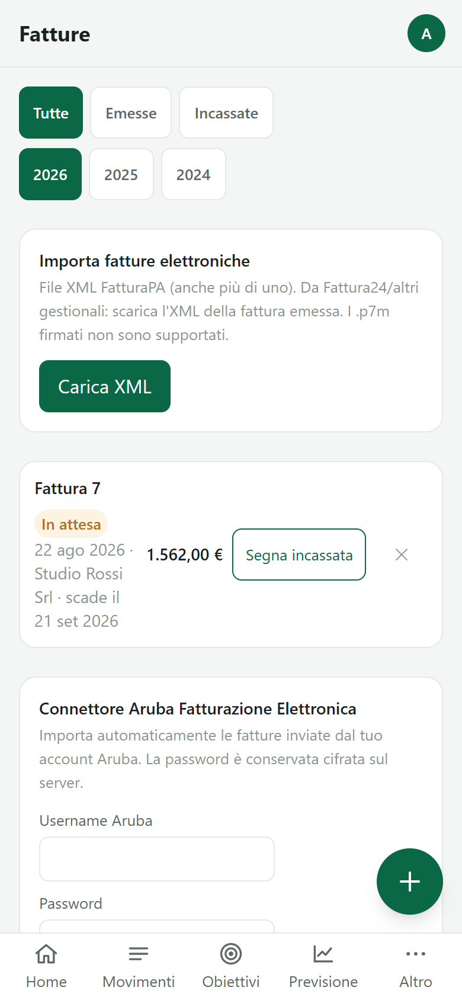

1. In **Altro → Fatture** carica uno o più file XML delle fatture emesse.
2. Le fatture in attesa compaiono in Home come **In arrivo**, con la data stimata d'incasso.
3. Quando incassi tocca **Incassa**: nasce l'entrata e la % tasse va nel salvadanaio.
4. Se registri un'entrata a mano con lo stesso importo, l'app riconosce la fattura da sola.

**Consiglio:** carica la fattura il giorno che la emetti: la Previsione la userà subito.

## Importa CSV

L'estratto conto della banca in un colpo solo: mappi le colonne una volta, l'app riconosce i doppioni, propone le categorie e scopre le spese ricorrenti.

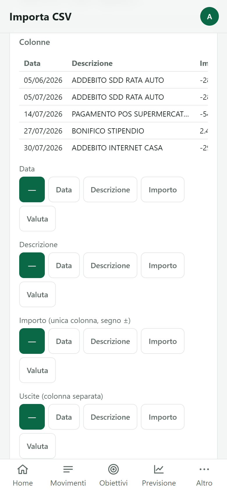

1. Esporta il CSV dalla banca e caricalo in **Altro → Importa CSV**.
2. Indica quali colonne sono data, descrizione e importo. Il mapping resta salvato.
3. Controlla l'anteprima: le righe già presenti sono segnate, le categorie proposte si correggono al volo. Spunta **ricorda** per insegnare una regola.
4. Importa. Le righe senza categoria finiscono in "Altro" con un filtro dedicato.
5. Le **ricorrenze rilevate** (stesso importo, stesso giorno, tre mesi) diventano regole con un tocco.

**Consiglio:** importa una volta al mese, dopo l'accredito dello stipendio.

## Famiglia e notifiche

Due persone, un solo bilancio. Tutto è condiviso tranne il salvadanaio tasse, che è di chi lo ha messo via.

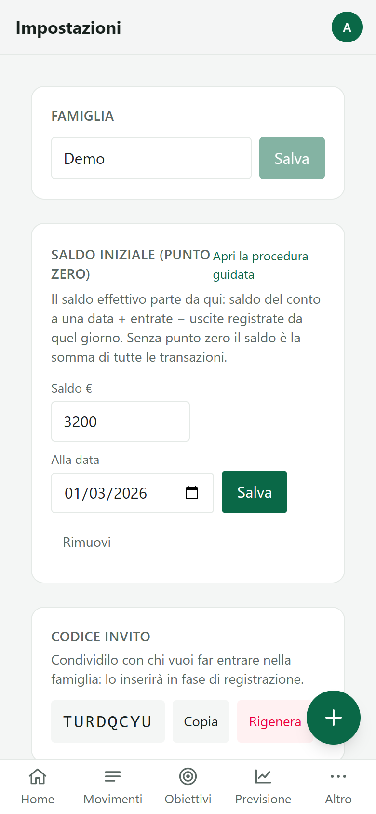

1. In **Altro → Impostazioni** trovi il codice invito: chi lo inserisce alla registrazione entra nella famiglia.
2. Il saldo iniziale si può correggere da qui.
3. In Home, **Attiva notifiche** accende gli avvisi: promemoria tasse, scadenze, ricorrenze da confermare, spese insolite.
4. Ogni modifica compare in tempo reale sul telefono dell'altro.

**Consiglio:** decidete chi registra cosa. Di solito funziona "chi paga, registra".

## La routine

**2 minuti al giorno.** Registra le spese del giorno (foto o manuale) e guarda il Disponibile reale.

**5 minuti a settimana.** Apri Movimenti: le variabili sono in linea col mese scorso? Conferma le ricorrenze in attesa. Controlla la Lista spesa prima di andare al supermercato.

**15 minuti al mese, insieme.** Importa l'estratto conto e chiudi i doppioni. Distribuisci quello che è rimasto sugli obiettivi. Guarda la Previsione dei prossimi 90 giorni e decidete se spostare qualcosa. Se ci sono tasse da versare, versatele.

Il resto lo fa l'app.
